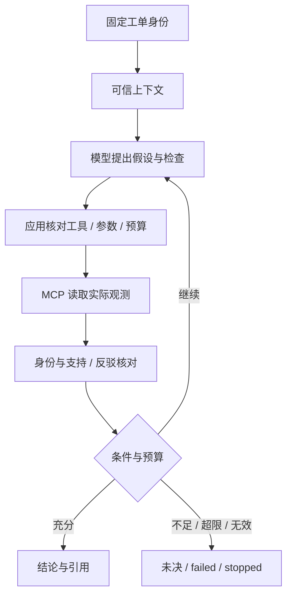

# 架构与可信边界

工单 → 版本知识与现场证据 → 检索 / 回答 → 受控调查 → 人工批准动作 → 回执 → 复盘与方法治理。

## 数据与引用

原资料保留格式、许可、版本、修订、字节与 SHA-256。正文、章节父块、子块及位置形成不可变快照；历史引用固定旧修订，不随更新指向新内容。工单、运行、索引、经验及任务受组织隔离。API 先核对组织和任务，再传入允许的产品 / 版本 / 来源，模型不能扩大范围。

## 检索与回答

索引记录 embedding 模型、维度与快照，变更需显式重建。精确余弦为向量基线，BM25 处理中文与标识符，RRF 合并排序，rerank 仅调整候选；父块扩展保留 child 引用并限制字符。排名不代表事实真实。结构化回答分别检查引用存在、版本、原句与语义支持；模型评审可能漏检，保留未复核标记。分步入口的澄清、改写及追加检索受调用和时间上限控制。

## 调查与 MCP

startup 与 online 采用不同工具。设计资料不能推出现场配置，缺失日志不能反驳假设。注册工具、动作类型、固定服务地址、任务身份与预算由应用管理；Skill 和 MCP 文本不是授权。

## 人工批准与恢复

动作建议绑定证据、实例、参数及前状态。审批后执行前重新核对，漂移或伪造被拒绝。completed 回执恢复只读回；started 缺少完成记录视为 uncertain，停止并禁止自动重复。SSE 传输持久化事件，重连不执行动作。取消 / 恢复核对身份及回执，不清除失败或重放副作用。控制范围只限隔离 RelayDesk 实验。

## 经验与 Skill

事件生成有来源摘要，再形成候选经验。冲突、版本、有效期、失效与撤销保留；召回仅辅助规划，不替代本次证据。Skill 渐进加载核对版本 / 正文 / 来源哈希，候选方法经固定回归、审批与显式发布；发布状态不等于语义正确或效果提升。

## 多 Agent

调度固定 DAG、两调查角色和归并角色。私有包限定工具、输入、上下文与子配额，MCP 再核对角色身份。总调用 / 时间 / 字符预算共享；超限与依赖失败停止。归并区分一致结论、未决冲突及失败任务，不补造结果。同预算比较保留全部分母；窗口、输出目标与子配额差异限制因果解释。

## 验证与边界

独立 Compose 使用新网络 / 卷、两套迁移和随机账号，拒绝模型密钥及付费开关。MockTransport 契约与真实 PostgreSQL 分别标记。HTTP / Chromium 验证隔离、身份、移动端与持久化，不能当成模型质量、远端 Actions、第二台机器或生产能力证明。
